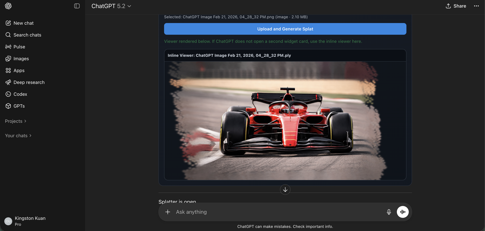

# Splatter MCP App

MCP app for generating and viewing 3D models using 3D Gaussian Splatting

Built with [`mcp-use`](https://github.com/mcp-use/mcp-use) and [`ml-sharp`](https://github.com/apple/ml-sharp).

🏆 Finalist at the [YC MCP Apps Hackathon by Manufact](https://events.ycombinator.com/manufact-hackathon26).



## Introduction

This is great for teams to move from source media to interactive 3D quickly

- Advertising
- Media and film
- Creative design
- Architecture
- Real estate

## Features

- Upload `.ply` and view instantly in an interactive widget.
- Upload an image and use 3DGS via Modal (async job flow).

ChatGPT image generation to 3DGS example:


## Tools Exposed

- `open-ply-upload`: opens upload widget (recommended entrypoint).
- `view-ply-splat`: render an existing `.ply`.
- `generate-splat-from-image`: direct image-to-splat tool path.

## Local Development

```bash
pnpm install
pnpm run dev
```

For ChatGPT connector testing:

```bash
pnpm run dev -- --tunnel
```

## Environment Variables

- `SHARP_MODAL_ENDPOINT_URL` (required): deployed Modal image-to-splat endpoint.
- `SHARP_MODAL_TIMEOUT_MS` (optional, default `300000`).
- `SHARP_MODAL_TIMEOUT_SECONDS` (optional fallback).
- `MCP_URL` (recommended for tunnel/deployed absolute URLs).

## Modal Backend

Deploy from `services/sharp-inference`:

```bash
cd services/sharp-inference
uv run modal token new
uv run modal deploy modal_app.py::modal_app
```

## Quality Checks

```bash
pnpm check
cd services/sharp-inference
uv run ruff check --fix
uv run ruff format
uv run ty check
```
